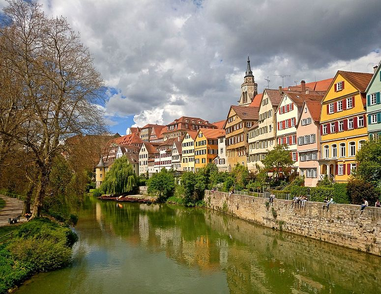
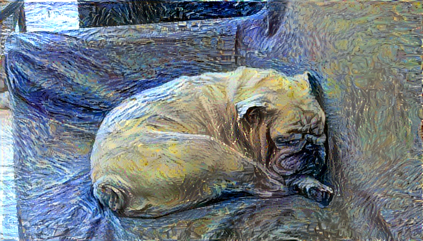

# Trabajo-Final-CV

### Referencia output punto 7

| Content | Style |
| --- | --- |
|  |  |

| total_variation_weight | style_weight | content_weight | interations |
| --- | --- | --- | --- |
| 0.01 | 10 | 1 | 100 |

| Content | Style |
| --- | --- |
|  |  |

| total_variation_weight | style_weight | content_weight | interations |
| --- | --- | --- | --- |
| 0.01 | 10 | 1 | 100 |

| Content | Style |
| --- | --- |
|  |  |

| total_variation_weight | style_weight | content_weight | interations |
| --- | --- | --- | --- |
| 0.01 | 10 | 1 | 40 |

